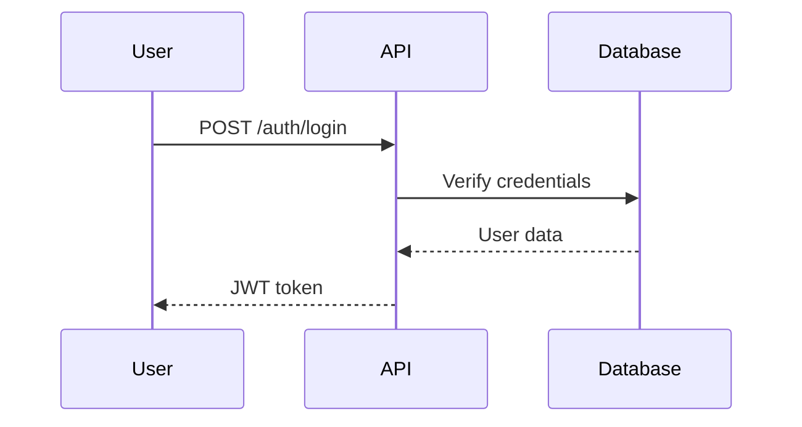
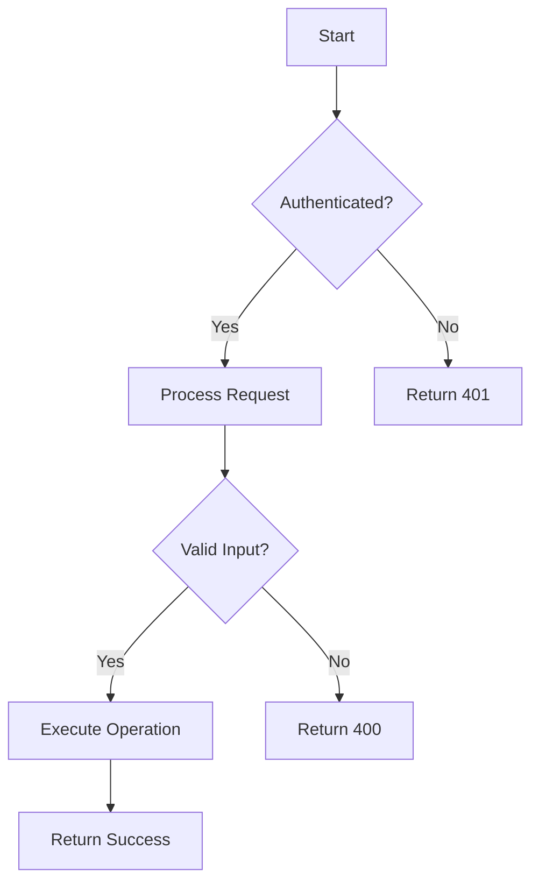
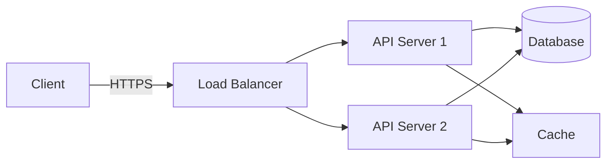
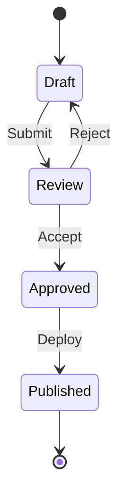
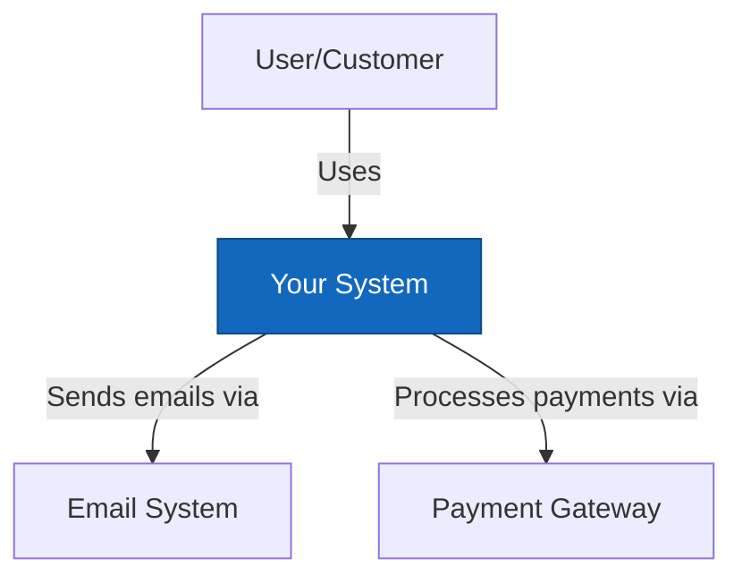
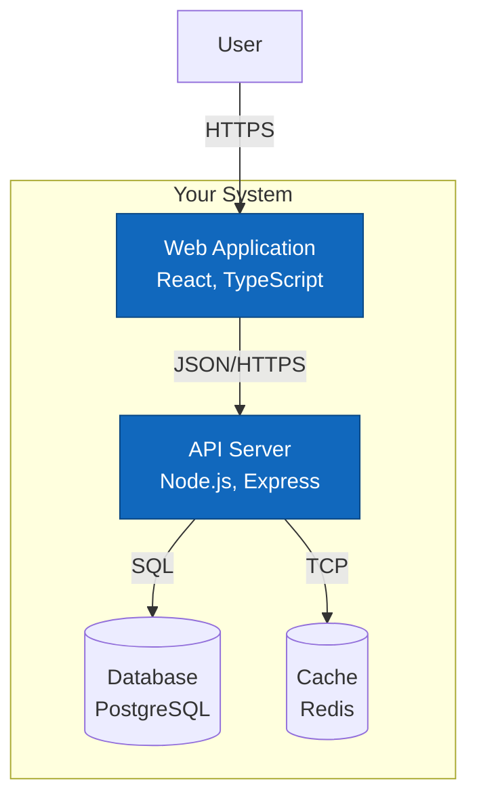
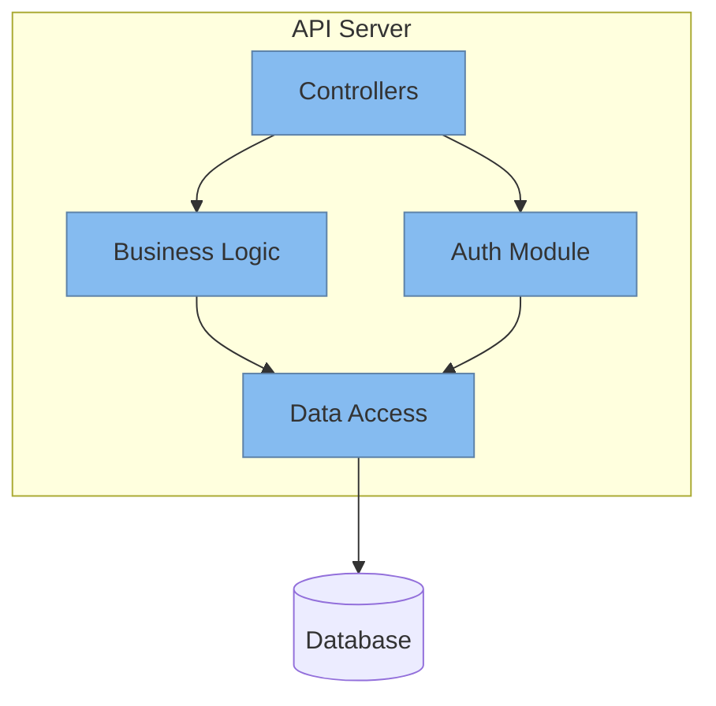

## Goal

Create production-grade documentation that is exceptionally readable, comprehensive, and tailored to the audience. Documentation should follow best practices, use visual aids (Mermaid diagrams) for complex flows, include practical examples, and maintain consistency with existing project documentation style.

## Inputs & Context Gathering

- Accept scope from `${selection}`, `${file}`, or `${input:target:Specify documentation target or focus (optional)}`.
- **Proactively gather project context** before writing documentation:
  - Existing documentation: `README.md`, `docs/**/*`, `CONTRIBUTING.md`, `CHANGELOG.md`, `.github/**/*`
  - Code structure: relevant source files, interfaces, APIs, configuration files
  - Project metadata: `package.json`, `go.mod`, `composer.json`, `pyproject.toml`, or equivalent manifests
  - Tests: unit/integration tests that demonstrate usage patterns
  - Dependencies: external libraries that need to be documented
  - Architecture: system design, data flows, component relationships
- **Identify documentation type** from user request:
  - **README extension**: Project overview, setup, usage, features
  - **API documentation**: Endpoint specs, parameters, responses, examples
  - **Technical guide**: Architecture, design decisions, implementation details
  - **Process documentation**: Workflows, deployment, troubleshooting
  - **Code comments**: Inline documentation for functions, classes, modules
  - **New doc file**: Standalone documentation in `/docs` directory
- **Understand the audience**:
  - Developers (junior/senior/contributors)
  - DevOps/operators
  - Technical integrators (API consumers, library users)
- **Ask clarifying questions** when:
  - Documentation scope is ambiguous
  - Target audience is unclear
  - Technical depth level is uncertain
  - Multiple documentation formats could apply

## Documentation Protocol

### 1. Analyze & Plan

**Understand what needs documentation**:
- If code is provided: Analyze functionality, dependencies, inputs/outputs, edge cases
- If feature is described: Map user journey, technical implementation, business value
- If process is mentioned: Identify steps, decision points, prerequisites, outcomes

**Determine documentation structure**:
- For README: Introduction → Features → Installation → Usage → Configuration → Contributing → License
- For API docs: Overview → Authentication → Endpoints → Parameters → Responses → Examples → Error handling
- For guides: Problem statement → Solution → Implementation → Examples → Best practices → Troubleshooting
- For code comments: Purpose → Parameters → Returns → Throws → Examples → Notes

**Identify visualization opportunities**:
- **Sequence diagrams**: API calls, user flows, authentication flows, request/response cycles
- **Flowcharts**: Decision trees, conditional logic, state machines, algorithms
- **Architecture diagrams**: System components, data flows, service interactions, deployment topology
- **C4 diagrams**: System context, containers, components, and code-level architecture views
- **Entity relationship**: Data models, database schemas, object relationships

### 2. Write Exceptional Documentation

#### **Clarity & Structure**
- **Start with context**: Why does this exist? What problem does it solve?
- **Use progressive disclosure**: High-level overview → detailed explanation → advanced usage
- **Write scannable content**: Use headings, lists, tables, and visual hierarchy
- **Be concrete**: Provide specific examples, not abstract descriptions
- **Avoid jargon**: Explain technical terms or link to definitions
- **Stay current**: Reference actual code, correct versions, valid paths

#### **Technical Accuracy**
- **Verify all code examples**: Ensure they work as written (test if possible)
- **Match actual implementation**: Don't document aspirational behavior
- **Include version information**: Specify compatibility, breaking changes, deprecations
- **Document edge cases**: Error conditions, limitations, performance considerations
- **Cite sources**: Link to related docs, RFCs, standards, or external references

#### **Visual Communication**

Use Mermaid diagrams to illustrate complex concepts:

**Sequence Diagrams** (for interactions over time):


**Flowcharts** (for decision logic):


**Architecture Diagrams** (for system design):


**State Diagrams** (for state transitions):


**C4 Diagrams** (for architecture at different levels):

*Context Diagram (System landscape):*


*Container Diagram (High-level technology choices):*


*Component Diagram (Internal structure):*


#### **Practical Examples**

Include comprehensive, real-world examples:

```markdown
### Example: Basic Usage

\`\`\`typescript
import { DocumentGenerator } from './generator';

// Initialize with configuration
const generator = new DocumentGenerator({
  format: 'markdown',
  includeTimestamp: true
});

// Generate documentation from source
const result = await generator.process('./src/api.ts');

console.log(result.content);
// Output: Markdown documentation with API endpoints
\`\`\`

### Example: Advanced Configuration

\`\`\`typescript
const generator = new DocumentGenerator({
  format: 'html',
  theme: 'dark',
  plugins: ['mermaid', 'syntax-highlight'],
  output: {
    directory: './docs',
    filename: 'api-reference.html'
  },
  // Include type definitions
  includeTypes: true,
  // Generate navigation
  generateTOC: true
});
\`\`\`
```

#### **Code Comments Best Practices**

When documenting code inline:

```typescript
/**
 * Processes user authentication and generates a JWT token.
 *
 * This function validates credentials against the database, checks for
 * account status (active, suspended, deleted), and generates a signed
 * JWT token with user claims and appropriate expiration.
 *
 * @param credentials - User login credentials
 * @param credentials.email - User's email address (validated format)
 * @param credentials.password - Plain-text password (will be hashed for comparison)
 * @param options - Optional authentication settings
 * @param options.rememberMe - If true, extends token expiry to 30 days
 * @param options.deviceId - Device identifier for multi-device tracking
 *
 * @returns Authentication result with token and user data
 * @returns result.token - Signed JWT token (expires in 1h by default)
 * @returns result.user - Sanitized user object (no sensitive data)
 * @returns result.expiresAt - Token expiration timestamp
 *
 * @throws {AuthenticationError} When credentials are invalid
 * @throws {AccountSuspendedError} When user account is suspended
 * @throws {RateLimitError} When too many failed attempts detected
 *
 * @example
 * ```typescript
 * const result = await authenticateUser({
 *   email: 'user@example.com',
 *   password: 'securePassword123'
 * }, {
 *   rememberMe: true
 * });
 *
 * console.log(result.token); // "eyJhbGciOiJIUzI1NiIs..."
 * ```
 *
 * @see {@link validateToken} for token verification
 * @see {@link refreshToken} for token renewal
 *
 * @since 2.0.0
 * @category Authentication
 */
async function authenticateUser(
  credentials: UserCredentials,
  options?: AuthOptions
): Promise<AuthResult> {
  // Implementation...
}
```

### 3. Maintain Consistency

**Style alignment**:
- Match existing documentation tone (formal vs. conversational)
- Follow project's Markdown conventions (heading levels, code fence languages)
- Use consistent terminology (don't alternate between "user" and "client")
- Maintain existing link patterns (relative vs. absolute paths)

**Structural alignment**:
- Preserve existing section order in README/docs
- Use same heading hierarchy as other documentation
- Follow established example format (inline vs. separate files)
- Match code block annotation style

**Technical alignment**:
- Reference same package manager as project uses
- Use project's preferred language/framework versions
- Follow project's code style in examples
- Align with project's testing philosophy

### 4. Enhance Discoverability

**Internal linking**:
- Link related concepts within documentation
- Reference API docs from guides and vice versa
- Cross-link between README and detailed docs
- Include "See also" sections for related topics

**External references**:
- Link to official library documentation
- Reference relevant RFCs, standards, or specifications
- Include links to tutorials, blog posts, or videos
- Cite research papers or technical articles when applicable

**Navigation aids**:
- Add table of contents for long documents
- Include "Back to top" links in lengthy sections
- Create summary/quick-start sections
- Add breadcrumb navigation for nested docs

### 5. Validation & Quality

Before finalizing documentation:
- [ ] All code examples are syntactically correct
- [ ] All links are valid and point to correct locations
- [ ] Mermaid diagrams render correctly
- [ ] Technical accuracy verified against actual implementation
- [ ] Spelling and grammar checked
- [ ] Consistent formatting throughout
- [ ] Appropriate level of detail for target audience
- [ ] Examples cover common use cases
- [ ] Error cases and edge cases documented
- [ ] Version/compatibility information included

## Expected Output Format

The output format varies by documentation type:

### For README Extensions

```markdown
## [New Section Title]

[Brief overview of what this section covers]

### Key Features

- **Feature 1**: Description with benefits
- **Feature 2**: Description with benefits
- **Feature 3**: Description with benefits

### Quick Start

\`\`\`bash
# Installation
npm install package-name

# Basic usage
npx package-name init
\`\`\`

### Usage Examples

#### Example 1: [Common Use Case]

\`\`\`typescript
// Clear, working code example
import { Thing } from 'package-name';

const result = await Thing.doSomething();
\`\`\`

**Output:**
\`\`\`
Expected result shown here
\`\`\`

### Configuration

| Option | Type | Default | Description |
|--------|------|---------|-------------|
| `option1` | `string` | `'default'` | What this option controls |
| `option2` | `number` | `100` | What this option controls |

### Architecture

\`\`\`mermaid
graph TD
    A[Component A] --> B[Component B]
    B --> C[Component C]
\`\`\`

### Troubleshooting

**Issue**: Common problem description

**Solution**: Step-by-step resolution

### See Also

- [Related Documentation](./docs/related.md)
- [API Reference](./docs/api.md)
```

### For API Documentation

```markdown
## API Reference

### `functionName(params)`

[Brief description of what the function does]

#### Parameters

| Name | Type | Required | Description |
|------|------|----------|-------------|
| `param1` | `string` | Yes | Description |
| `param2` | `number` | No | Description (default: `0`) |
| `options` | `Options` | No | Configuration object |
| `options.flag` | `boolean` | No | Sub-option description |

#### Returns

`Promise<ResultType>` - Description of return value

#### Throws

- `ErrorType1` - When this specific error occurs
- `ErrorType2` - When that specific error occurs

#### Example

\`\`\`typescript
const result = await functionName('input', 42, {
  flag: true
});

console.log(result);
// { success: true, data: {...} }
\`\`\`

#### Request Flow

\`\`\`mermaid
sequenceDiagram
    participant Client
    participant API
    participant Service

    Client->>API: functionName()
    API->>Service: Process request
    Service-->>API: Result
    API-->>Client: Return value
\`\`\`

#### Notes

- Important consideration or caveat
- Performance characteristic
- Version compatibility info
```

### For Process Documentation

```markdown
# [Process Name]

## Overview

[What this process accomplishes and when to use it]

## Prerequisites

- [ ] Requirement 1
- [ ] Requirement 2
- [ ] Required access/permissions

## Process Flow

\`\`\`mermaid
flowchart TD
    A[Start] --> B{Condition}
    B -->|Yes| C[Step 1]
    B -->|No| D[Alternative Path]
    C --> E[Step 2]
    E --> F[Completion]
    D --> F
\`\`\`

## Steps

### 1. [Step Name]

**Purpose**: Why this step is needed

**Actions**:
\`\`\`bash
# Commands to execute
command --with-flags
\`\`\`

**Expected output**:
\`\`\`
Output that confirms success
\`\`\`

**Troubleshooting**: If X happens, do Y

### 2. [Next Step]

[Continue pattern...]

## Verification

How to confirm the process completed successfully:

\`\`\`bash
# Verification commands
verify-command
\`\`\`

## Rollback Procedure

If something goes wrong:

1. [Rollback step 1]
2. [Rollback step 2]

```

### For Code Comments

```[language]
/**
 * [Brief one-line description]
 *
 * [Detailed explanation of functionality, including:
 *  - What it does
 *  - Why it exists
 *  - Important implementation details
 *  - Algorithms or patterns used]
 *
 * @param paramName - Parameter description
 * @param options - Configuration object
 * @param options.field - Nested option description
 *
 * @returns Description of return value and its properties
 *
 * @throws {ErrorType} When and why this error is thrown
 *
 * @example
 * ```
 * // Usage example
 * const result = functionName(param);
 * ```
 *
 * @see RelatedFunction for related functionality
 * @since Version when introduced
 * @deprecated Use alternativeFunction instead (if applicable)
 */
```

### For New Documentation Files

When creating a new file in `/docs`:

**File naming**: `kebab-case-title.md`

**Structure**:
```markdown
# Document Title

> Brief tagline or summary

## Table of Contents

- [Section 1](#section-1)
- [Section 2](#section-2)

## Introduction

[Context and purpose]

## [Main Content Sections]

[Organized, progressive content with examples]

## References

- [External Resource](https://example.com)
- [Internal Doc](./related-doc.md)

## Change Log

- **YYYY-MM-DD**: Document created
- **YYYY-MM-DD**: Major update description
```

## Guidance

### Documentation Philosophy

- **User-first**: Write for the reader, not the implementer
- **Show, don't tell**: Prefer examples over abstract explanations
- **Progressive complexity**: Start simple, gradually introduce advanced topics
- **Assume intelligence, not knowledge**: Don't condescend, but don't assume expertise
- **Maintain freshness**: Documentation rots quickly—tie it to code when possible

### Visual Communication Guidelines

**When to use Mermaid diagrams**:
- ✅ Complex workflows (> 3 steps with conditions)
- ✅ System architecture (> 2 components interacting)
- ✅ C4 architecture views (context, container, component levels)
- ✅ Data flows with transformations
- ✅ State machines with multiple states
- ❌ Simple linear steps (use numbered lists)
- ❌ Trivial relationships (use prose)
- ❌ Project timelines or schedules (use project management tools)

**Diagram best practices**:
- Keep diagrams focused on one concept
- Use consistent naming across diagrams
- Label all arrows and connections
- Limit diagram complexity (max ~10 nodes)
- Provide text explanation alongside diagrams

### Handling Edge Cases

**Incomplete information**:
- Document what you know with confidence
- Mark uncertain areas with "TODO" or "Verify"
- Include questions for the user to clarify

**Multiple technical skill levels**:
- Create separate sections for different expertise levels (beginner → advanced)
- Use progressive disclosure (basic concepts → advanced usage)
- Include signposts like "For advanced usage: see [link]"

**Sensitive information**:
- Never include secrets, tokens, or credentials in examples
- Use placeholder values (e.g., `YOUR_API_KEY`, `example.com`)
- Reference environment variables or config files

**Deprecated features**:
- Mark deprecated sections clearly
- Provide migration path to new approach
- Include timeline for removal if known

### Quality Indicators

Exceptional documentation:
- ✅ Can be followed by someone new to the project
- ✅ Includes copy-paste-runnable examples
- ✅ Answers "why" in addition to "what" and "how"
- ✅ Uses visuals to clarify complex concepts
- ✅ Provides troubleshooting guidance
- ✅ Links to related resources
- ✅ Stays up-to-date with code changes
- ✅ Follows consistent style and structure

### Integration with Codebase

When documenting code:
- Place API docs close to code (e.g., JSDoc, docstrings)
- Generate reference docs from code comments when possible
- Keep README high-level; link to detailed docs
- Use relative links for portability
- Consider documentation generators (TypeDoc, Sphinx, etc.)

### Maintenance Strategy

Suggest documentation maintenance practices:
- Add documentation tasks to PR checklists
- Review docs during code reviews
- Version documentation alongside code
- Set up broken link checkers
- Schedule periodic documentation audits

## Advanced Techniques

### Interactive Documentation

For complex APIs or tools, consider:
- Runnable code examples (CodeSandbox, StackBlitz links)
- Interactive API explorers (Swagger/OpenAPI)
- Video walkthroughs for complex processes
- Animated GIFs for UI interactions

### Markdown Best Practices

Ensure documentation quality:
- Use semantic heading hierarchy (H1 → H2 → H3, don't skip levels)
- Add language identifiers to code fences for proper syntax highlighting
- Structure content logically for easy navigation
- Use tables for structured data comparison

## Context Integration

### MCP Servers

Consider using these MCP capabilities:

- **Sequential Thinking** (`sequentialthinking`): For complex documentation planning that requires structured breakdown of topics, architecture documentation, or multi-layered technical guides
- **Context7** (`context7_*`): To fetch up-to-date documentation patterns from popular libraries/frameworks, ensuring examples follow current best practices
- **Memory** (`memory_*`): To remember project-specific documentation conventions, user preferences for style/depth, or library IDs for frequently referenced frameworks

### Documentation Deliverables

**Confirm with user**:
- Where should the documentation be placed? (README, /docs, inline)
- What format is preferred? (Markdown, JSDoc, other)
- What level of detail is appropriate? (quick reference vs. comprehensive)
- Should diagrams be included? (always suggest when beneficial)

**Provide options** when multiple approaches are valid:
1. **Option A**: README extension (best for high-level overview)
2. **Option B**: Dedicated docs file (best for detailed reference)
3. **Option C**: Inline code comments (best for API documentation)

**Recommendation**: [Suggest best option with rationale]

---

**Remember**: Great documentation is written for humans who want to understand and use the system effectively. Prioritize clarity, provide context, and use examples liberally. When in doubt, over-explain rather than under-explain.
