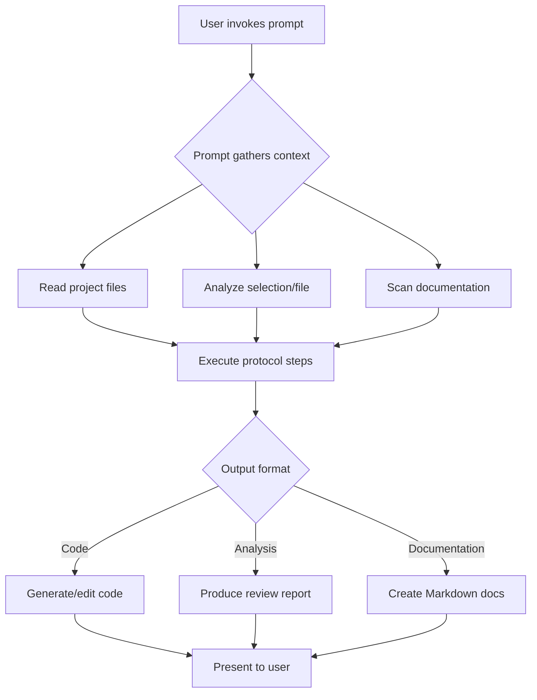
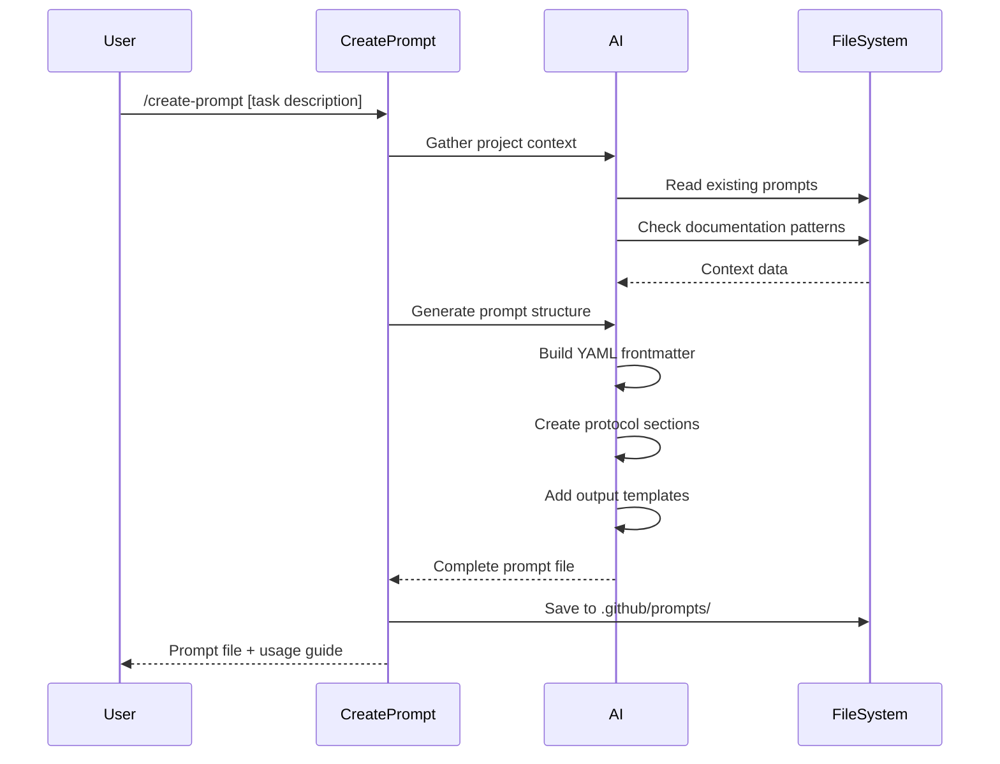
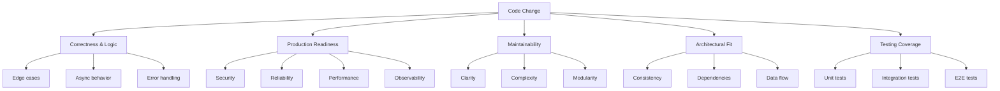
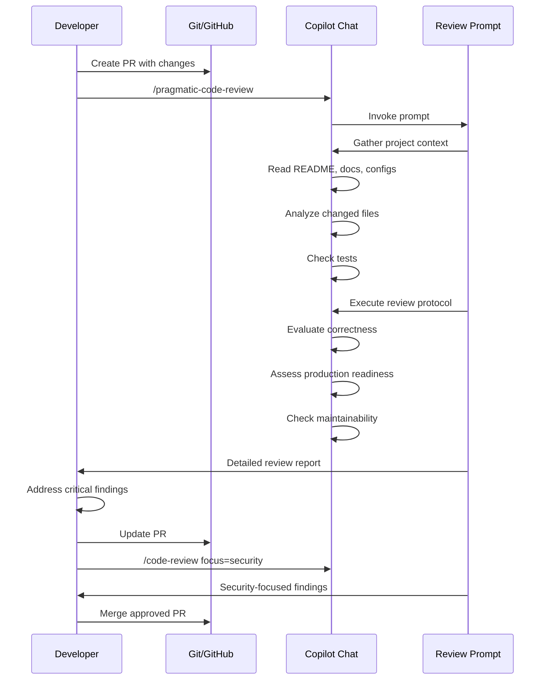

# Custom Prompts Guide

> A comprehensive guide to using VS Code and GitHub Copilot custom prompts for enhanced development workflows

## Table of Contents

- [Introduction](#introduction)
- [Why Use Custom Prompts?](#why-use-custom-prompts)
- [When to Use Custom Prompts](#when-to-use-custom-prompts)
- [How Custom Prompts Work](#how-custom-prompts-work)
- [Creating Custom Prompts](#creating-custom-prompts)
- [Using Code Review Prompts](#using-code-review-prompts)
- [Best Practices](#best-practices)
- [References](#references)

## Introduction

Custom prompts in VS Code and GitHub Copilot allow you to create reusable, structured workflows that automate common development tasks. Instead of repeatedly typing similar instructions, you can invoke pre-defined prompts that guide Copilot to perform complex operations consistently.

This project includes several powerful custom prompts designed to enhance code quality, streamline documentation, and accelerate development workflows.

**Official Documentation**: [VS Code Copilot Prompt Files](https://code.visualstudio.com/docs/copilot/customization/prompt-files)

## Why Use Custom Prompts?

Custom prompts provide several key benefits:

### **Consistency**

- Ensure code reviews follow the same rigorous standards every time
- Apply uniform documentation patterns across your project
- Maintain consistent code quality regardless of who performs the review

### **Efficiency**

- Reduce repetitive typing of complex instructions
- Automate multi-step workflows with a single command
- Save time on routine tasks like code reviews, documentation generation, and refactoring

### **Knowledge Capture**

- Encode team best practices and coding standards into reusable prompts
- Share expertise across the team through well-designed prompt templates
- Onboard new team members faster with guided workflows

### **Quality Improvement**

- Leverage structured analysis frameworks for thorough code reviews
- Apply comprehensive checklists that prevent oversight
- Use proven methodologies consistently across all code changes

### **Customization**

- Tailor prompts to your project's specific needs and tech stack
- Adjust depth and focus based on context (hotfix vs. feature vs. refactor)
- Create domain-specific workflows for your organization

## When to Use Custom Prompts

Custom prompts are ideal for:

### **Repetitive Tasks**

- Code reviews that follow a standard checklist
- Documentation generation with consistent structure
- Refactoring operations with specific patterns
- Test generation following team conventions

### **Complex Workflows**

- Multi-step code analysis requiring context gathering
- Architecture reviews with cross-file analysis
- Security audits with comprehensive vulnerability scanning
- Performance optimization with profiling and measurement

### **Knowledge-Intensive Operations**

- Reviewing code in unfamiliar codebases
- Applying industry best practices automatically
- Ensuring compliance with coding standards
- Validating against architectural patterns

### **Collaboration**

- Sharing review methodologies across team members
- Standardizing documentation formats
- Maintaining consistent code quality gates
- Onboarding new contributors

## How Custom Prompts Work

### **File Structure**

Custom prompts are Markdown files with YAML frontmatter, typically stored in `.github/prompts/`:

```markdown
---
name: prompt-name
description: "Brief description shown in VS Code"
agent: agent
argument-hint: "Guidance text for user input"
---

## Goal
[What this prompt accomplishes]

## Inputs & Context Gathering
[How the prompt gathers necessary information]

## Protocol
[Step-by-step instructions for the AI]

## Expected Output Format
[Template for the deliverable]
```

### **Invocation**

Use the slash command syntax in GitHub Copilot Chat:

```text
/prompt-name [optional arguments]
```

**Examples**:

- `/code-review` - Review current file or selection
- `/create-prompt` - Generate a new custom prompt
- `/document` - Create documentation for selected code

### **Workflow**



## Creating Custom Prompts

This project includes the `/create-prompt` workflow to help you build new custom prompts following best practices.

### **Using `/create-prompt`**

The `/create-prompt` prompt is a meta-prompt that generates new prompt files for you. It ensures your prompts follow VS Code conventions and include proper structure.

**Invocation**:

```text
/create-prompt [describe the workflow or task to automate]
```

**Example**:

```text
/create-prompt Create a prompt that generates unit tests for TypeScript functions with Jest
```

### **What `/create-prompt` Does**



### **Generated Prompt Structure**

The `/create-prompt` workflow produces a complete prompt file with:

1. **YAML Frontmatter**
   - `name`: Kebab-case identifier for invocation
   - `description`: One-line summary for VS Code UI
   - `agent`: Execution mode (typically `agent` for full capabilities)
   - `argument-hint`: Guidance text shown to users

2. **Goal Section**
   - Clear statement of what the prompt accomplishes
   - Target audience or use case

3. **Inputs & Context Gathering**
   - Variables used (`${selection}`, `${file}`, `${input:...}`)
   - Project context to gather (docs, configs, tests)
   - When to ask clarifying questions

4. **Protocol Section**
   - Step-by-step instructions for the AI
   - Decision trees and reasoning checkpoints
   - Tool usage and validation steps

5. **Expected Output Format**
   - Templates with placeholders
   - Concrete examples
   - Fallback behavior

6. **Guidance Section** (optional but recommended)
   - Edge case handling
   - Quality standards
   - Best practices

### **Example: Creating a Test Generation Prompt**

**User request**:

```text
/create-prompt Generate integration tests for Express.js API endpoints with supertest
```

**Generated prompt** (excerpt):

```markdown
---
name: generate-api-tests
description: "Generate integration tests for Express.js endpoints using supertest"
agent: agent
argument-hint: "Optional: specify endpoint or test framework"
---

## Goal
Generate comprehensive integration tests for Express.js API endpoints using supertest,
covering happy paths, error cases, authentication, and validation.

## Inputs & Context Gathering
- Use `${selection}` for selected endpoint code or `${file}` for route files
- Scan existing tests to match naming conventions and structure
- Read API route definitions to extract endpoints, methods, and middleware
- Check for authentication schemes and validation rules

## Protocol
1. **Analyze endpoint**: Extract HTTP method, path, expected inputs, responses
2. **Identify test scenarios**: Happy path, error cases, edge cases, auth checks
3. **Generate test suite**: Create describe blocks with before/after hooks
4. **Write test cases**: Assert status codes, response bodies, database state
5. **Add documentation**: Comment complex assertions and setup logic

## Expected Output Format
\`\`\`typescript
import request from 'supertest';
import app from '../app';

describe('POST /api/users', () => {
  // Test cases here
});
\`\`\`
```

### **Customizing Generated Prompts**

After generation, you can:

- Refine protocol steps based on team needs
- Add project-specific context sources
- Adjust output templates
- Include examples from your codebase
- Add tool restrictions if needed

### **Prompt Creation Best Practices**

When using `/create-prompt`, provide clear context:

✅ **Good**:

```text
/create-prompt Create a prompt that reviews database migration files for
SQL injection risks, missing rollback procedures, and performance issues
```

❌ **Vague**:

```text
/create-prompt make code better
```

**Include**:

- Specific task or workflow to automate
- Target programming language or framework (if relevant)
- Expected output format (code, report, checklist)
- Quality standards or validation requirements

**The `/create-prompt` workflow will**:

- Ask clarifying questions if your description is too broad
- Scan existing prompts to avoid duplication
- Match your project's documentation style
- Suggest related prompts or complementary workflows

## Using Code Review Prompts

This project includes two powerful code review prompts, each optimized for different review scenarios:

### **`/code-review` - High-Rigor Technical Review**

**Purpose**: Fast, uncompromising technical review that surfaces critical issues first.

**Best for**:

- Pre-merge code reviews in CI/CD pipelines
- Security-sensitive changes
- Performance-critical code paths
- API contract changes
- Database schema migrations

**What it checks**:

- Logic correctness and edge cases
- Cross-file and architectural impact
- Security, privacy, and performance
- Testing coverage and regression risks
- Contract and dependency compatibility

**Invocation**:

```text
/code-review
```

**With focus area**:

```text
/code-review focus=security
/code-review focus=performance
```

**Output format**:

```markdown
## Findings
| Severity | File/Location | Details |
| --- | --- | --- |
| critical | auth.ts:42-48 | SQL injection vulnerability in raw query |
| major | api.ts:103 | Missing error handling for async operation |

## Questions / Assumptions
- Is the authentication middleware applied to all protected routes?

## Follow-ups & Tests
- Add integration test for authentication failure scenarios
- Run static analysis with SQL injection detector
```

**Key features**:

- **Severity-based prioritization**: Critical issues first
- **Evidence-based**: Cites specific file locations and line numbers
- **Context-aware**: Scans project docs, configs, and existing patterns
- **Fast feedback**: Concise findings table for quick triage

### **`/pragmatic-code-review` - Production-Focused Review**

**Purpose**: Thorough, pragmatic review balancing engineering rigor with real-world constraints.

**Best for**:

- Feature development reviews
- Refactoring initiatives
- Production readiness assessments
- Architectural changes
- Team code review standards

**What it evaluates**:



**Invocation**:

```text
/pragmatic-code-review
```

**With focus**:

```text
/pragmatic-code-review security
/pragmatic-code-review maintainability
```

**Output format**:

```markdown
## Review Summary
- **Intent**: Implement user authentication with JWT tokens
- **Scope**: 5 files changed, affects auth subsystem
- **Risk Level**: Medium - new authentication flow with proper testing

## Critical Findings

### 🚨 Blockers
*[Must be fixed before merge]*

| Location | Issue | Impact | Recommendation |
|----------|-------|--------|----------------|
| `auth.ts:L67` | JWT secret hardcoded | Security breach | Move to env var |

### ⚠️ Critical Issues
*[Should be fixed before merge]*

| Location | Issue | Impact | Recommendation |
|----------|-------|--------|----------------|
| `middleware.ts:L23` | Missing rate limiting | DoS vulnerability | Add express-rate-limit |

### 📌 Important Issues
*[Address soon, can merge with explicit acceptance of risk]*

| Location | Issue | Impact | Recommendation |
|----------|-------|--------|----------------|
| `routes.ts:L88` | No logging on auth failures | Harder to debug | Add structured logging |

### 💡 Suggestions
*[Nice-to-haves, refactoring opportunities]*

- Consider extracting token validation to separate service for reusability
- Token expiry could be configurable per environment

## Testing Assessment

- **Current Coverage**: Unit tests for token generation, missing integration tests
- **Gaps**: No tests for token expiration, refresh flow, or concurrent sessions
- **Recommendations**:
  - Add integration test: successful login → protected route access
  - Add test: expired token rejection
  - Add test: invalid token format handling

## Approval Recommendation

**APPROVE WITH CONDITIONS**

**Rationale**: Solid implementation with proper error handling and tests.
Blockers are trivial to fix. Critical issues should be addressed before production deployment.

**Conditions**:
- Fix hardcoded secret (blocker)
- Add rate limiting or track as follow-up ticket
```

**Key features**:

- **Tradeoff analysis**: Pragmatic decisions over theoretical perfection
- **Risk-based prioritization**: Focus on what truly matters in production
- **Approval guidance**: Clear merge recommendations with conditions
- **Actionable feedback**: Specific fixes with effort estimates

### **Choosing Between Review Prompts**

| Scenario | Use `/code-review` | Use `/pragmatic-code-review` |
|----------|-------------------|----------------------------|
| **Quick pre-merge check** | ✅ Fast, critical issues only | ❌ Too comprehensive |
| **Feature development** | ⚠️ May be too strict | ✅ Balanced rigor |
| **Hotfix review** | ✅ Focus on correctness | ✅ With focus=security |
| **Refactoring PR** | ⚠️ Limited architectural insight | ✅ Architectural fit analysis |
| **Security audit** | ✅ With focus=security | ✅ With security focus |
| **Production readiness** | ❌ Missing operational checks | ✅ Full readiness assessment |
| **Team review standard** | ❌ Too terse | ✅ Educational feedback |

### **Review Workflow Example**



### **Advanced Review Usage**

**Review specific files**:

1. Select code in editor
2. Open Copilot Chat
3. Run `/pragmatic-code-review`
4. Review applies to selection only

**Review with context**:

```text
/pragmatic-code-review

Additional context: This code runs in a serverless environment
with strict 512MB memory limit and 30s timeout.
```

**Iterative reviews**:

```text
# First pass
/code-review

# After fixes
/code-review focus=testing

# Final check
/pragmatic-code-review
```

**Team review checklists**:
Create a PR template that includes:

```markdown
## Code Review Checklist
- [ ] Run `/pragmatic-code-review` and address blockers
- [ ] Verify testing coverage meets standards
- [ ] Confirm no security vulnerabilities found
- [ ] Validate performance impact is acceptable
```

## Best Practices

### **Effective Prompt Usage**

1. **Provide context**: Select relevant code or specify the file before invoking prompts
2. **Use focus areas**: Narrow the scope when you have specific concerns
3. **Iterate**: Run prompts multiple times as you refine your code
4. **Combine prompts**: Use `/code-review` for quick checks, `/pragmatic-code-review` for thorough analysis
5. **Ask follow-ups**: Copilot Chat maintains conversation context—ask clarifying questions

### **Prompt Maintenance**

1. **Version control**: Keep prompts in `.github/prompts/` under source control
2. **Document changes**: Update prompt descriptions when modifying behavior
3. **Test prompts**: Validate prompts work as expected after changes
4. **Share knowledge**: Document custom prompts in project README or this guide
5. **Iterate**: Refine prompts based on team feedback and usage patterns

### **Creating New Prompts**

1. **Start with `/create-prompt`**: Let the meta-prompt scaffold the structure
2. **Be specific**: Clearly define the task, inputs, and expected outputs
3. **Include examples**: Add concrete examples in the protocol section
4. **Test thoroughly**: Run the prompt on various scenarios before sharing
5. **Document usage**: Add entry to this guide when creating team-wide prompts

### **Common Pitfalls to Avoid**

❌ **Don't**:

- Invoke prompts without providing sufficient context (select code first)
- Use overly broad prompts when specific focus is needed
- Ignore blocker-level findings from reviews
- Create duplicate prompts—check existing ones first
- Hardcode project-specific details in prompts (use context gathering instead)

✅ **Do**:

- Read the prompt description to understand what it does
- Provide additional context in chat when needed
- Address critical findings before merging code
- Leverage `/create-prompt` for consistency
- Share useful prompts with your team

## References

### **Official Documentation**

- [VS Code Copilot Prompt Files](https://code.visualstudio.com/docs/copilot/customization/prompt-files)

### **Project Prompts**

- [create-prompt.prompt.md](../.github/prompts/create-prompt.prompt.md) - Generate new custom prompts
- [code-review.prompt.md](../.github/prompts/code-review.prompt.md) - High-rigor technical reviews
- [pragmatic-code-review.prompt.md](../.github/prompts/pragmatic-code-review.prompt.md) - Production-focused reviews
- [document.prompt.md](../.github/prompts/document.prompt.md) - Generate comprehensive documentation

### **Additional Resources**

- [Prompt Engineering Guide](https://www.promptingguide.ai/)
- [GitHub Copilot Cookbook](https://docs.github.com/copilot/tutorials/copilot-chat-cookbook)

---

## Change Log

- **2025-11-16**: Initial documentation created
  - Explained custom prompt fundamentals
  - Documented `/create-prompt` workflow
  - Comprehensive code review prompts guide
  - Added best practices and examples
