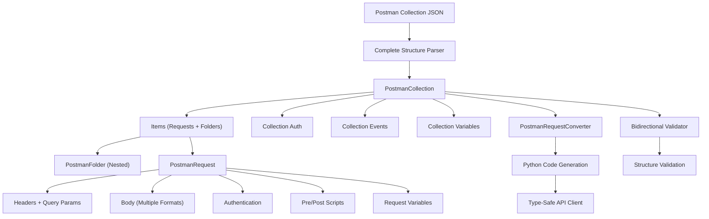

# Postman API Client Generator

A comprehensive Python library for converting Postman collections into fully functional Python API client code with complete structure validation and type safety.

## Overview

This library transforms Postman collections into structured Python code, enabling programmatic access to APIs documented in Postman. It provides comprehensive modeling of the entire Postman collection structure including variables, events, authentication, nested folders, and response examples, with bidirectional validation to ensure data integrity.

**Postman to API Client [YouTube Tutorial](https://youtu.be/CuxqKKF-6f8)**

**Domo [Postman Collection](https://api.datacrew.space/)**

## Key Features

### Complete Structure Modeling
- **Full Postman Collection Support**: Models every aspect of Postman collections including variables, events, authentication, nested folders, and response examples
- **Bidirectional Validation**: `from_dict()` and `to_dict()` methods on all classes ensure perfect round-trip conversion and validation
- **Type-Safe Dataclasses**: Comprehensive Python dataclasses with proper type hints for all Postman collection components
- **Hierarchical Structure**: Full support for nested folders and complex collection organization

### Advanced Request/Response Handling
- **Complete Request Modeling**: Headers with metadata (disabled, description, type), query parameters with descriptions, URL variables, and multiple body formats
- **Response Examples**: Full response modeling including headers, cookies, status codes, and preview languages
- **Authentication Support**: Comprehensive auth modeling for all Postman authentication types
- **Event System**: Pre-request and test scripts with full event modeling

### Code Generation & Validation
- **Automatic Code Generation**: Creates Python API client functions with proper type hints
- **Test Code Generation**: Builds comprehensive test functions for each API endpoint
- **Structure Validation**: Validates that dataclass models completely capture input/output JSON structures
- **Customization Options**: Allows customizing how specific endpoints are processed

## Project Structure

- `models.py`: Comprehensive dataclasses that model the complete Postman collection structure
- `converter.py`: Conversion logic to transform Postman requests into Python code
- `tester.py`: Testing utilities for generated API functions
- `implementation.ipynb`: Jupyter notebook demonstrating the implementation workflow
- `utils.py`: Helper functions for request handling and code generation

## Dataclass Architecture

### Core Collection Components
- **PostmanCollection**: Root container with full structure support (items, auth, events, variables)
- **PostmanFolder**: Nested folder support with recursive item handling
- **PostmanRequest**: Complete request modeling with all metadata and options
- **PostmanResponse**: Full response examples with headers, cookies, and body content

### Supporting Components
- **PostmanVariable**: Collection, folder, and request-level variables
- **PostmanEvent**: Pre-request and test scripts with execution context
- **PostmanAuth**: Authentication configuration for all auth types
- **PostmanUrl**: URL modeling with host, path, query parameters, and variables
- **PostmanRequest_Body**: Multiple body formats (raw, form-data, URL-encoded, file, GraphQL)
- **PostmanRequest_Header**: Headers with disabled state, descriptions, and types

## Structure Validation

All dataclasses implement comprehensive validation through:

```python
# Load and validate a Postman collection
collection = PostmanCollection.from_file("collection.json")

# Convert back to dict and validate round-trip
original_dict = json.load(open("collection.json"))
reconstructed_dict = collection.to_dict()

# Validate that input matches output (complete structure coverage)
assert original_dict == reconstructed_dict
```

## How It Works



## Usage Examples

### Basic Collection Loading and Validation

```python
from postman.converter.models import PostmanCollection
import json

# Load a Postman collection with full structure validation
collection = PostmanCollection.from_file("my_collection.json")

# Access collection metadata
print(f"Collection: {collection.info.name}")
print(f"Schema: {collection.info.schema}")

# Access collection-level variables
if collection.variable:
    for var in collection.variable:
        print(f"Variable: {var.key} = {var.value}")

# Access collection-level authentication
if collection.auth:
    print(f"Auth Type: {collection.auth.type}")
```

### Working with Folders and Nested Structures

```python
# Iterate through all items (requests and folders)
for item in collection.item:
    if isinstance(item, PostmanFolder):
        print(f"Folder: {item.name}")
        # Process nested items recursively
        for nested_item in item.item:
            if hasattr(nested_item, 'method'):  # It's a request
                print(f"  Request: {nested_item.name} ({nested_item.method})")
    else:  # It's a direct request
        print(f"Request: {item.name} ({item.method})")

# Get all requests flattened (including nested ones)
all_requests = collection.requests
print(f"Total requests: {len(all_requests)}")
```

### Request Analysis and Validation

```python
for request in collection.requests:
    print(f"\nRequest: {request.name}")
    print(f"Method: {request.method}")
    print(f"URL: {request.url.raw if request.url.raw else 'N/A'}")
    
    # Analyze headers
    if request.header:
        print("Headers:")
        for header in request.header:
            status = "disabled" if header.disabled else "enabled"
            print(f"  {header.key}: {header.value} ({status})")
            if header.description:
                print(f"    Description: {header.description}")
    
    # Analyze query parameters
    if request.url.query:
        print("Query Parameters:")
        for param in request.url.query:
            status = "disabled" if param.disabled else "enabled"
            print(f"  {param.key}: {param.value} ({status})")
            if param.description:
                print(f"    Description: {param.description}")
    
    # Analyze request body
    if request.body:
        print(f"Body Mode: {request.body.mode}")
        if request.body.raw:
            print(f"Raw Body: {request.body.raw[:100]}...")
        if request.body.formdata:
            print(f"Form Data: {len(request.body.formdata)} fields")
    
    # Analyze authentication
    if request.auth:
        print(f"Auth Type: {request.auth.type}")
    
    # Analyze events (scripts)
    if request.event:
        print("Events:")
        for event in request.event:
            print(f"  {event.listen}: {len(event.script.exec) if event.script and event.script.exec else 0} lines")
```

### Structure Validation and Round-Trip Testing

```python
import json

# Load original JSON
with open("collection.json", "r") as f:
    original_data = json.load(f)

# Parse into dataclasses
collection = PostmanCollection.from_dict(original_data)

# Convert back to dictionary
reconstructed_data = collection.to_dict()

# Validate complete structure preservation
def validate_structure(original, reconstructed, path=""):
    """Recursively validate that all structure is preserved."""
    if isinstance(original, dict):
        for key, value in original.items():
            assert key in reconstructed, f"Missing key: {path}.{key}"
            validate_structure(value, reconstructed[key], f"{path}.{key}")
    elif isinstance(original, list):
        assert len(original) == len(reconstructed), f"Length mismatch at {path}"
        for i, (orig_item, recon_item) in enumerate(zip(original, reconstructed)):
            validate_structure(orig_item, recon_item, f"{path}[{i}]")
    else:
        assert original == reconstructed, f"Value mismatch at {path}: {original} != {reconstructed}"

# Run validation
validate_structure(original_data, reconstructed_data)
print("✅ Structure validation passed - all components captured!")
```

### Advanced Features

#### Variable Extraction and Analysis

```python
# Extract all variables from collection, folders, and requests  
all_variables = {}

# Collection-level variables
if collection.variable:
    for var in collection.variable:
        all_variables[f"collection.{var.key}"] = var.value

# Folder and request variables
def extract_variables(items, prefix=""):
    for item in items:
        if isinstance(item, PostmanFolder):
            if item.variable:
                for var in item.variable:
                    all_variables[f"{prefix}folder.{item.name}.{var.key}"] = var.value
            extract_variables(item.item, f"{prefix}{item.name}.")
        elif hasattr(item, 'variable') and item.variable:
            for var in item.variable:
                all_variables[f"{prefix}request.{item.name}.{var.key}"] = var.value

extract_variables(collection.item)
print("All Variables:", all_variables)
```

#### Response Example Analysis

```python
for request in collection.requests:
    if request.response:
        print(f"\nRequest: {request.name}")
        for i, response in enumerate(request.response):
            print(f"  Example {i+1}: {response.name}")
            print(f"    Status: {response.status} ({response.code})")
            
            # Analyze response headers
            if response.header:
                print("    Response Headers:")
                for header in response.header:
                    print(f"      {header.key}: {header.value}")
            
            # Analyze response body
            if response.body:
                print(f"    Body Length: {len(response.body)} chars")
                if response._postman_previewlanguage:
                    print(f"    Preview Language: {response._postman_previewlanguage}")
```

## API Reference

### PostmanCollection
- `from_file(file_path: str)`: Load collection from JSON file
- `from_dict(data: Dict[str, Any])`: Create from dictionary
- `to_dict()`: Convert to dictionary for validation
- `requests`: Property returning all requests (flattened)

### PostmanRequest
- `from_dict(item_data: Dict[str, Any])`: Create from request data
- `to_dict()`: Convert to dictionary representation
- Complete modeling of method, headers, URL, body, auth, events, variables

### PostmanFolder
- `from_dict(folder_data: Dict[str, Any])`: Create from folder data
- `to_dict()`: Convert to dictionary representation  
- Recursive support for nested folders and items

### Validation Features
- All classes implement `from_dict()` and `to_dict()` methods
- Complete round-trip validation ensures no data loss
- Type-safe dataclasses with comprehensive attribute coverage
- Support for all Postman collection features including edge cases

## Advanced Validation

The converter includes comprehensive validation to ensure that the dataclass structure completely models the Postman collection format:

```python
# Test with complex collections
def test_collection_completeness():
    # Load a complex collection with all features
    collection = PostmanCollection.from_file("complex_collection.json")
    
    # Convert to dict and back
    as_dict = collection.to_dict()
    reconstructed = PostmanCollection.from_dict(as_dict)
    
    # Verify complete structure preservation
    assert as_dict == reconstructed.to_dict()
    
    print("✅ Collection structure completely modeled!")

# Run comprehensive validation
test_collection_completeness()
```

This ensures that variables, parameters, events, authentication, folder structures, and all other Postman collection components are fully captured by the dataclass structure.
