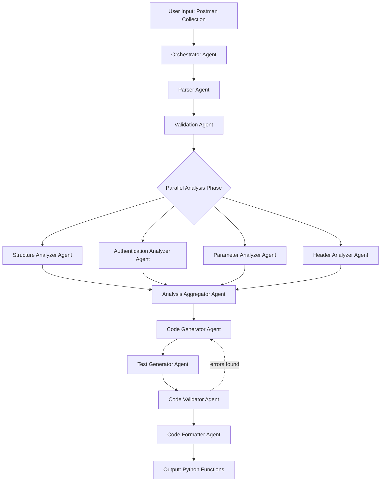

# Postman to Python Converter: Multi-Agent Design

## Overview

This document outlines a multi-agent framework using pydantic-ai for converting Postman collections into Python API client functions. The system uses specialized agents in an orchestrator-worker pattern with graph-based control flow.

## Architecture Pattern

**Pattern**: Orchestrator-Worker with Graph-Based Control Flow + Semantic Routing

**Rationale**:
- Postman conversion requires multiple specialized analysis steps (parsing, validation, code generation, testing)
- Each step has distinct expertise requirements
- Some steps can run in parallel (analysis tasks)
- Others must be sequential (generation depends on analysis)
- Results need to be aggregated into cohesive output

## Agent Graph Design



## Agent Specifications

### 1. Orchestrator Agent

**Purpose**: Coordinate the entire conversion workflow

**Output Model**:
```python
class ConversionPlan(BaseModel):
    collection_name: str
    total_requests: int
    processing_strategy: str = Field(description="sequential or parallel")
    estimated_complexity: str = Field(description="low, medium, high")
    next_step: str
```

**System Prompt**:
```
You are a workflow orchestrator for Postman collection conversion.
Analyze the input collection and determine the optimal processing strategy.
Consider collection size, nesting depth, and complexity when planning.
Coordinate agent execution and handle errors gracefully.
```

**Tools**:
- `route_to_parser`: Send collection to Parser Agent
- `check_agent_status`: Monitor agent progress
- `aggregate_results`: Combine results from multiple agents

---

### 2. Parser Agent

**Purpose**: Parse and load Postman collection into structured models

**Output Model**:
```python
class ParsedCollection(BaseModel):
    collection: dict = Field(description="Parsed PostmanCollection as dict")
    total_requests: int
    folder_structure: list[str] = Field(description="List of folder paths")
    parsing_issues: list[str] = Field(default_factory=list)
    collection_variables: dict[str, str]
    collection_auth: Optional[dict] = None
```

**System Prompt**:
```
You are a Postman collection parser specializing in converting JSON collections
into structured Python dataclass models. Use the PostmanCollection.from_dict()
method to parse collections. Identify any structural issues, missing fields,
or format problems. Extract metadata about folders, requests, and variables.
```

**Tools**:
- `load_collection_from_file`: Load JSON file
- `parse_with_models`: Use PostmanCollection.from_dict()
- `validate_structure`: Check for completeness
- `extract_metadata`: Get collection info

---

### 3. Validation Agent

**Purpose**: Validate collection structure and completeness

**Output Model**:
```python
class ValidationReport(BaseModel):
    is_valid: bool
    errors: list[str] = Field(default_factory=list)
    warnings: list[str] = Field(default_factory=list)
    recommendations: list[str] = Field(default_factory=list)
    passed_checks: list[str] = Field(default_factory=list)
```

**System Prompt**:
```
You are a Postman collection validator. Verify that the collection structure
is complete and follows best practices. Check for:
- Required fields (name, method, url)
- Valid HTTP methods
- Well-formed URLs
- Proper authentication configuration
- Response examples presence
Provide actionable recommendations for issues found.
```

**Tools**:
- `validate_required_fields`: Check mandatory fields
- `validate_urls`: Verify URL format
- `validate_auth`: Check auth configuration
- `check_best_practices`: Apply validation rules

---

### 4. Structure Analyzer Agent

**Purpose**: Analyze collection structure and request organization

**Output Model**:
```python
class StructureAnalysis(BaseModel):
    folder_hierarchy: dict[str, list[str]]
    request_groupings: dict[str, list[str]]
    naming_patterns: list[str] = Field(description="Identified naming conventions")
    suggested_module_structure: dict[str, list[str]]
    complexity_score: int = Field(ge=1, le=10)
```

**System Prompt**:
```
You are a software architect analyzing Postman collection structure.
Identify patterns in folder organization, request naming, and logical groupings.
Suggest optimal Python module structure for generated code.
Consider API design patterns and REST conventions.
```

**Tools**:
- `analyze_folder_tree`: Examine folder hierarchy
- `identify_patterns`: Find naming patterns
- `suggest_modules`: Recommend code organization

---

### 5. Authentication Analyzer Agent

**Purpose**: Analyze authentication requirements and patterns

**Output Model**:
```python
class AuthAnalysis(BaseModel):
    auth_types: list[str] = Field(description="Types of auth used: bearer, basic, apikey, etc.")
    auth_locations: list[str] = Field(description="collection, folder, request")
    requires_token_refresh: bool
    auth_variables: list[str] = Field(description="Variables used in auth")
    suggested_auth_class: str = Field(description="Recommended auth class name")
    auth_implementation_notes: str
```

**System Prompt**:
```
You are an API authentication specialist. Analyze authentication patterns
in the Postman collection. Identify auth types, inheritance patterns,
and variable usage. Recommend optimal authentication class design for
the Python client. Consider token refresh requirements and security best practices.
```

**Tools**:
- `extract_auth_config`: Get auth from collection/folders/requests
- `analyze_auth_patterns`: Identify common patterns
- `suggest_auth_design`: Recommend implementation

---

### 6. Parameter Analyzer Agent

**Purpose**: Analyze query parameters and path variables

**Output Model**:
```python
class ParameterAnalysis(BaseModel):
    common_params: dict[str, list[str]] = Field(description="Parameters used across multiple requests")
    required_params: dict[str, list[str]] = Field(description="Request name to required params")
    optional_params: dict[str, list[str]] = Field(description="Request name to optional params")
    param_types: dict[str, str] = Field(description="Inferred parameter types")
    default_values: dict[str, str] = Field(description="Default values for params")
    path_variables: dict[str, list[str]] = Field(description="Path variables per request")
```

**System Prompt**:
```
You are a parameter analysis specialist. Examine query parameters and path
variables across all requests. Identify common parameters that appear in
multiple endpoints. Infer parameter types from examples and values.
Determine which parameters should be required vs optional in generated functions.
Suggest sensible defaults where possible.
```

**Tools**:
- `extract_all_params`: Get params from all requests
- `infer_param_types`: Determine types from values
- `identify_common_params`: Find shared parameters
- `suggest_defaults`: Recommend default values

---

### 7. Header Analyzer Agent

**Purpose**: Analyze HTTP headers and their usage patterns

**Output Model**:
```python
class HeaderAnalysis(BaseModel):
    common_headers: dict[str, list[str]] = Field(description="Headers used across requests")
    required_headers: list[str] = Field(description="Headers needed for all requests")
    optional_headers: dict[str, list[str]] = Field(description="Request-specific headers")
    header_variables: list[str] = Field(description="Variables in header values")
    content_types: list[str] = Field(description="Content-Type values found")
    auth_headers: list[str] = Field(description="Headers used for authentication")
```

**System Prompt**:
```
You are a HTTP header analysis expert. Examine headers across all requests
in the collection. Identify which headers are global (should be in auth/config)
vs request-specific. Find headers that use variables. Determine content types
and their usage patterns. Distinguish between auth-related and functional headers.
```

**Tools**:
- `extract_all_headers`: Get headers from all requests
- `categorize_headers`: Group by usage pattern
- `identify_variables`: Find variable usage in headers
- `suggest_header_design`: Recommend header handling

---

### 8. Analysis Aggregator Agent

**Purpose**: Synthesize analysis from all analyzer agents

**Output Model**:
```python
class AggregatedAnalysis(BaseModel):
    structure: dict = Field(description="From Structure Analyzer")
    authentication: dict = Field(description="From Auth Analyzer")
    parameters: dict = Field(description="From Parameter Analyzer")
    headers: dict = Field(description="From Header Analyzer")

    code_generation_strategy: str = Field(description="Recommended approach")
    module_organization: dict[str, list[str]]
    shared_components: list[str] = Field(description="Components to generate once")
    per_request_customization: dict[str, dict]
    complexity_assessment: str
```

**System Prompt**:
```
You are a meta-analyst specializing in synthesizing multiple analysis reports.
Combine insights from structure, authentication, parameter, and header analyses.
Identify conflicts and resolve them intelligently. Create a unified strategy
for code generation that leverages insights from all sources. Determine what
should be shared vs per-request. Provide clear guidance for the code generator.
```

**Tools**:
- `combine_analyses`: Merge all analysis results
- `resolve_conflicts`: Handle contradictions
- `generate_strategy`: Create unified approach

---

### 9. Code Generator Agent

**Purpose**: Generate Python API client functions

**Output Model**:
```python
class GeneratedCode(BaseModel):
    function_name: str
    function_code: str = Field(description="Complete Python function code")
    imports_needed: list[str] = Field(description="Import statements required")
    dependencies: list[str] = Field(description="Other functions this depends on")
    docstring: str
    type_hints: dict[str, str] = Field(description="Parameter name to type hint")
    complexity: str = Field(description="low, medium, high")
```

**System Prompt**:
```
You are a Python code generation expert specializing in API client functions.
Generate clean, type-hinted, well-documented Python functions from Postman requests.
Follow Python best practices and the project's coding standards. Use async/await
patterns consistently. Include comprehensive docstrings with Args, Returns, Raises.
Leverage analysis insights to create optimal function signatures. Generate
efficient, maintainable code that handles errors gracefully.
```

**Tools**:
- `generate_function`: Create function from request
- `generate_type_hints`: Add type annotations
- `generate_docstring`: Create documentation
- `apply_formatting`: Format code with black/ruff

---

### 10. Test Generator Agent

**Purpose**: Generate test functions for generated code

**Output Model**:
```python
class GeneratedTests(BaseModel):
    test_function_name: str
    test_code: str = Field(description="Complete test function code")
    test_fixtures: list[str] = Field(description="Fixtures needed")
    mock_data: dict = Field(description="Mock data for testing")
    assertions: list[str] = Field(description="Key assertions made")
    test_coverage_areas: list[str] = Field(description="What aspects are tested")
```

**System Prompt**:
```
You are a test generation specialist. Create comprehensive test functions for
generated API client code. Include tests for success cases, error handling,
parameter validation, and edge cases. Use pytest patterns with async support.
Generate meaningful assertions and helpful test fixtures. Leverage response
examples from Postman collection as test data when available.
```

**Tools**:
- `generate_test_function`: Create test code
- `extract_test_data`: Get data from response examples
- `generate_fixtures`: Create pytest fixtures
- `generate_mocks`: Create mock data

---

### 11. Code Validator Agent

**Purpose**: Validate generated code for correctness and quality

**Output Model**:
```python
class ValidationResult(BaseModel):
    is_valid: bool
    syntax_errors: list[str] = Field(default_factory=list)
    type_errors: list[str] = Field(default_factory=list)
    style_issues: list[str] = Field(default_factory=list)
    security_concerns: list[str] = Field(default_factory=list)
    suggestions: list[str] = Field(default_factory=list)
    passed_checks: list[str] = Field(default_factory=list)
```

**System Prompt**:
```
You are a code quality validator. Check generated Python code for syntax errors,
type consistency, style compliance, and security issues. Verify that code follows
project conventions. Check for common pitfalls like SQL injection, XSS, insecure
auth handling. Ensure async/await is used correctly. Validate that all imports
are available and type hints are accurate.
```

**Tools**:
- `check_syntax`: Parse with AST
- `check_types`: Run mypy validation
- `check_style`: Apply ruff/black
- `check_security`: Scan for security issues

---

### 12. Code Formatter Agent

**Purpose**: Format and polish generated code

**Output Model**:
```python
class FormattedCode(BaseModel):
    formatted_function: str
    formatted_tests: str
    imports_block: str
    file_header: str = Field(description="Module docstring and metadata")
    changes_made: list[str] = Field(description="Formatting changes applied")
```

**System Prompt**:
```
You are a code formatting specialist. Apply consistent formatting to generated
code using black and ruff. Organize imports using isort. Add appropriate file
headers and module docstrings. Ensure line length, indentation, and style
consistency. Make the code production-ready and maintainable.
```

**Tools**:
- `format_with_black`: Apply black formatting
- `format_with_ruff`: Apply ruff rules
- `organize_imports`: Sort imports with isort
- `generate_file_header`: Create module documentation

---

## Graph State Definition

```python
from typing import Annotated, Optional
from typing_extensions import TypedDict
from pydantic import BaseModel, Field

class PostmanConversionState(TypedDict):
    """State for the Postman to Python conversion graph."""

    # Input
    collection_path: str
    export_folder: str
    customize_config: Optional[dict]

    # Orchestration
    conversion_plan: Optional[dict]
    current_phase: str

    # Parsing
    parsed_collection: Optional[dict]
    validation_report: Optional[dict]

    # Parallel Analysis Results
    structure_analysis: Optional[dict]
    auth_analysis: Optional[dict]
    parameter_analysis: Optional[dict]
    header_analysis: Optional[dict]

    # Aggregated Analysis
    aggregated_analysis: Optional[dict]

    # Code Generation
    generated_functions: list[dict]
    generated_tests: list[dict]

    # Validation
    validation_results: list[dict]

    # Final Output
    formatted_code: dict[str, str]  # filename -> code
    export_paths: list[str]

    # Error Handling
    errors: list[str]
    warnings: list[str]
```

## Workflow Implementation

### Phase 1: Orchestration & Parsing (Sequential)

```python
async def orchestration_node(state: PostmanConversionState):
    """Plan conversion strategy."""
    orchestrator_agent = initialize_orchestrator_agent()

    result = await orchestrator_agent.run(
        f"Plan conversion for collection at {state['collection_path']}"
    )

    return {
        "conversion_plan": result.output.model_dump(),
        "current_phase": "parsing"
    }

async def parsing_node(state: PostmanConversionState):
    """Parse Postman collection."""
    parser_agent = initialize_parser_agent()

    result = await parser_agent.run(
        f"Parse collection from {state['collection_path']}"
    )

    return {
        "parsed_collection": result.output.model_dump(),
        "current_phase": "validation"
    }

async def validation_node(state: PostmanConversionState):
    """Validate parsed collection."""
    validator_agent = initialize_validation_agent()

    collection_str = json.dumps(state["parsed_collection"])
    result = await validator_agent.run(
        f"Validate this collection: {collection_str}"
    )

    if not result.output.is_valid:
        return {
            "errors": result.output.errors,
            "current_phase": "error"
        }

    return {
        "validation_report": result.output.model_dump(),
        "current_phase": "analysis"
    }
```

### Phase 2: Parallel Analysis

```python
async def parallel_analysis_node(state: PostmanConversionState):
    """Run all analyzers in parallel."""

    collection = state["parsed_collection"]
    collection_str = json.dumps(collection)

    # Initialize all analyzer agents
    struct_agent = initialize_structure_analyzer()
    auth_agent = initialize_auth_analyzer()
    param_agent = initialize_parameter_analyzer()
    header_agent = initialize_header_analyzer()

    # Run in parallel
    struct_task = struct_agent.run(f"Analyze structure: {collection_str}")
    auth_task = auth_agent.run(f"Analyze authentication: {collection_str}")
    param_task = param_agent.run(f"Analyze parameters: {collection_str}")
    header_task = header_agent.run(f"Analyze headers: {collection_str}")

    # Wait for all to complete
    struct_result, auth_result, param_result, header_result = await asyncio.gather(
        struct_task, auth_task, param_task, header_task
    )

    return {
        "structure_analysis": struct_result.output.model_dump(),
        "auth_analysis": auth_result.output.model_dump(),
        "parameter_analysis": param_result.output.model_dump(),
        "header_analysis": header_result.output.model_dump(),
        "current_phase": "aggregation"
    }
```

### Phase 3: Aggregation & Code Generation (Sequential)

```python
async def aggregation_node(state: PostmanConversionState):
    """Aggregate all analysis results."""
    aggregator_agent = initialize_aggregator_agent()

    analyses = {
        "structure": state["structure_analysis"],
        "auth": state["auth_analysis"],
        "parameters": state["parameter_analysis"],
        "headers": state["header_analysis"]
    }

    result = await aggregator_agent.run(
        f"Aggregate these analyses: {json.dumps(analyses)}"
    )

    return {
        "aggregated_analysis": result.output.model_dump(),
        "current_phase": "code_generation"
    }

async def code_generation_node(state: PostmanConversionState):
    """Generate Python functions."""
    code_gen_agent = initialize_code_generator()

    collection = state["parsed_collection"]
    analysis = state["aggregated_analysis"]

    generated_functions = []

    # Generate code for each request
    for request in collection["requests"]:
        context = {
            "request": request,
            "analysis": analysis,
            "strategy": analysis["code_generation_strategy"]
        }

        result = await code_gen_agent.run(
            f"Generate function for: {json.dumps(context)}"
        )

        generated_functions.append(result.output.model_dump())

    return {
        "generated_functions": generated_functions,
        "current_phase": "test_generation"
    }
```

### Phase 4: Testing & Validation

```python
async def test_generation_node(state: PostmanConversionState):
    """Generate test functions."""
    test_gen_agent = initialize_test_generator()

    generated_tests = []

    for func in state["generated_functions"]:
        result = await test_gen_agent.run(
            f"Generate tests for: {json.dumps(func)}"
        )
        generated_tests.append(result.output.model_dump())

    return {
        "generated_tests": generated_tests,
        "current_phase": "validation"
    }

async def code_validation_node(state: PostmanConversionState):
    """Validate generated code."""
    validator_agent = initialize_code_validator()

    validation_results = []

    for func in state["generated_functions"]:
        result = await validator_agent.run(
            f"Validate this code: {func['function_code']}"
        )
        validation_results.append(result.output.model_dump())

    # Check if any validation failed
    has_errors = any(not r["is_valid"] for r in validation_results)

    if has_errors:
        # Could implement retry logic here
        return {
            "validation_results": validation_results,
            "current_phase": "error",
            "errors": ["Code validation failed"]
        }

    return {
        "validation_results": validation_results,
        "current_phase": "formatting"
    }
```

### Phase 5: Formatting & Export

```python
async def formatting_node(state: PostmanConversionState):
    """Format and prepare for export."""
    formatter_agent = initialize_formatter_agent()

    formatted_code = {}

    # Format each function
    for func, test in zip(state["generated_functions"], state["generated_tests"]):
        context = {"function": func, "test": test}

        result = await formatter_agent.run(
            f"Format and prepare: {json.dumps(context)}"
        )

        filename = f"{func['function_name']}.py"
        formatted_code[filename] = result.output.formatted_function

    return {
        "formatted_code": formatted_code,
        "current_phase": "complete"
    }
```

## Building the Graph

```python
from langgraph.graph import StateGraph, START, END

def create_postman_conversion_graph():
    """Create the Postman to Python conversion graph."""

    graph_builder = StateGraph(PostmanConversionState)

    # Add all nodes
    graph_builder.add_node("orchestrator", orchestration_node)
    graph_builder.add_node("parser", parsing_node)
    graph_builder.add_node("validator", validation_node)
    graph_builder.add_node("parallel_analysis", parallel_analysis_node)
    graph_builder.add_node("aggregator", aggregation_node)
    graph_builder.add_node("code_generator", code_generation_node)
    graph_builder.add_node("test_generator", test_generation_node)
    graph_builder.add_node("code_validator", code_validation_node)
    graph_builder.add_node("formatter", formatting_node)

    # Define edges (workflow)
    graph_builder.add_edge(START, "orchestrator")
    graph_builder.add_edge("orchestrator", "parser")
    graph_builder.add_edge("parser", "validator")
    graph_builder.add_edge("validator", "parallel_analysis")
    graph_builder.add_edge("parallel_analysis", "aggregator")
    graph_builder.add_edge("aggregator", "code_generator")
    graph_builder.add_edge("code_generator", "test_generator")
    graph_builder.add_edge("test_generator", "code_validator")
    graph_builder.add_edge("code_validator", "formatter")
    graph_builder.add_edge("formatter", END)

    return graph_builder.compile()
```

## Tool Definitions

Each agent needs access to tools. Here are key tool examples:

```python
from pydantic_ai import Tool

# Parser Agent Tools
@Tool
async def load_collection_from_file(file_path: str) -> dict:
    """Load Postman collection from JSON file."""
    from .models import PostmanCollection
    collection = PostmanCollection.from_file(file_path)
    return collection.to_dict()

@Tool
async def validate_structure(collection_dict: dict) -> bool:
    """Validate that collection structure is complete."""
    from .models import PostmanCollection
    try:
        collection = PostmanCollection.from_dict(collection_dict)
        reconstructed = collection.to_dict()
        return collection_dict == reconstructed
    except Exception:
        return False

# Code Generator Tools
@Tool
async def generate_function_signature(request: dict, analysis: dict) -> str:
    """Generate function signature with proper parameters."""
    # Use existing PostmanRequestConverter logic
    from .converter import PostmanRequestConverter
    # Implementation
    pass

@Tool
async def format_code_with_black(code: str) -> str:
    """Format code using black."""
    import black
    return black.format_str(code, mode=black.Mode())
```

## Usage Example

```python
# Initialize the graph
conversion_graph = create_postman_conversion_graph()

# Run conversion
async def convert_collection(
    collection_path: str,
    export_folder: str,
    customize_config: Optional[dict] = None
):
    """Convert a Postman collection to Python functions."""

    initial_state = {
        "collection_path": collection_path,
        "export_folder": export_folder,
        "customize_config": customize_config or {},
        "current_phase": "init",
        "generated_functions": [],
        "generated_tests": [],
        "validation_results": [],
        "errors": [],
        "warnings": []
    }

    # Run the graph
    result = await conversion_graph.ainvoke(initial_state)

    # Export files
    for filename, code in result["formatted_code"].items():
        filepath = os.path.join(export_folder, filename)
        with open(filepath, "w") as f:
            f.write(code)

    return result

# Use it
result = await convert_collection(
    collection_path="Domo Product APIs.postman_collection.json",
    export_folder="./generated",
    customize_config={
        "required_headers": ["authorization", "content-type"],
        "default_params": ["limit", "offset"]
    }
)
```

## Benefits of This Design

1. **Separation of Concerns**: Each agent has a single, well-defined responsibility
2. **Parallelization**: Analysis agents run concurrently for faster processing
3. **Modularity**: Agents can be developed, tested, and improved independently
4. **Error Handling**: Each phase can detect and report errors gracefully
5. **Extensibility**: New agents can be added without disrupting existing workflow
6. **Observability**: Clear state transitions make debugging easier
7. **Reusability**: Agents can be reused in other contexts
8. **Quality**: Multiple validation points ensure high-quality output

## Next Steps

1. Implement each agent with proper pydantic models
2. Define comprehensive tool sets for each agent
3. Add error recovery and retry logic
4. Implement progress tracking and logging
5. Add metrics collection for optimization
6. Create UI/CLI interface for the graph
7. Add support for streaming updates
8. Implement caching for repeated conversions

## References

- [Pydantic AI Multi-Agent Documentation](https://ai.pydantic.dev/multi-agent-applications/)
- [LangGraph Documentation](https://langchain-ai.github.io/langgraph/)
- Existing codebase: `src/postman/therapist/` (reference implementation)
- Existing models: `src/postman/converter/models.py`
